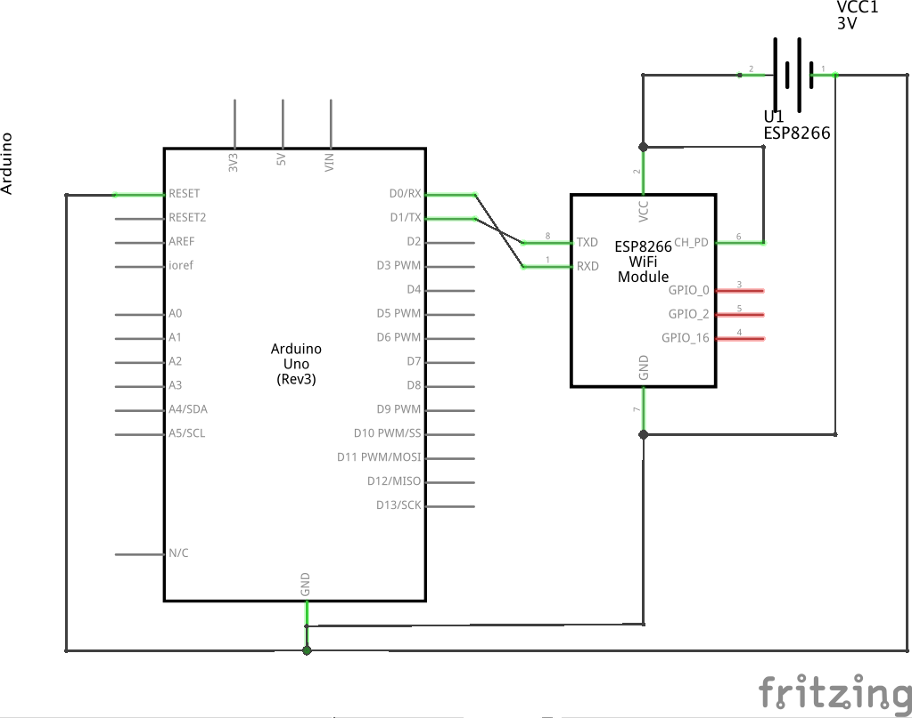
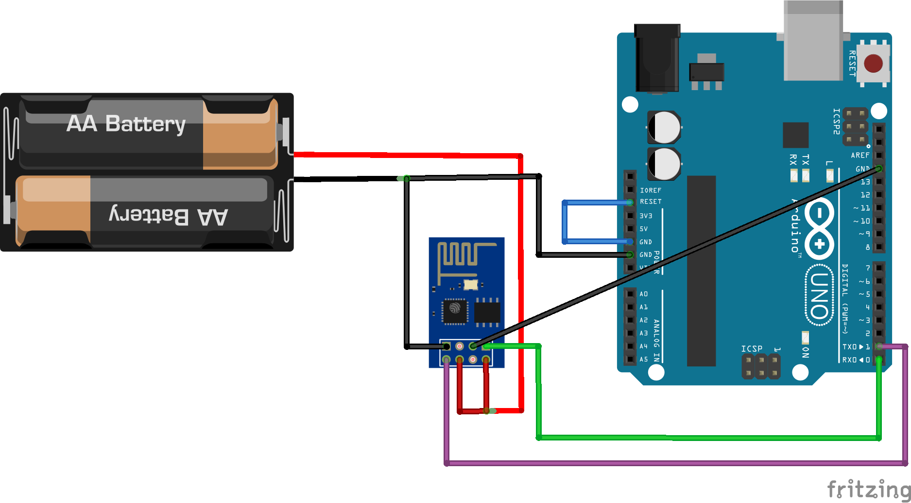

#Programming an ESP8266 using an Arduino as a serial passthrough

Connections:

* ESP ground to battery ground
* ESP ground to Arduino ground
* ESP 3.3v to battery 3.3v
* ESP TX to Arduino TX
* ESP RX to Arduino RX
* ESP CH_PD to battery 3.3V

Arduino IDE setup:
* Select Tools > Board > Generic ESP8266 board
* Select Tools > Port > (your arduino USB port)
* Select Tools > Programmer > esptool

Every time you want to upload new code, do this:

* Connect ESP GPIO0 to GND and then reboot (remove a battery and plug it back in)
* Upload the code in processing
* When programming finishes, unplug this connection (ESP GPIO0) and reboot again.

